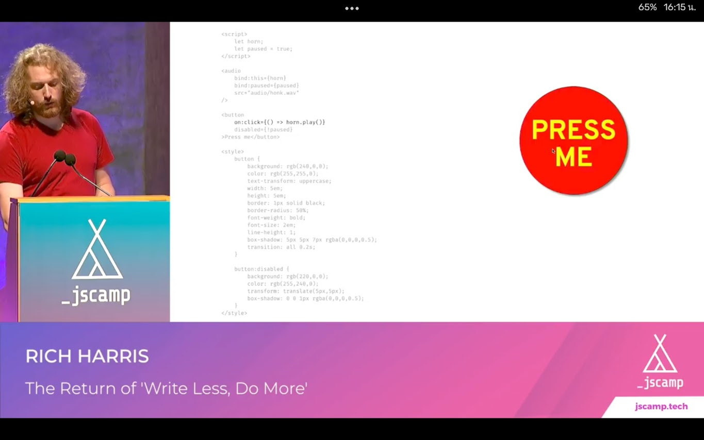

# imba-horn

implement "button which play horn sound when click" that Rich Harris demo on "write less, do more" talk (2019 JSCamp)

- [x] play sound when click
- [x] appearance css
- [ ] animation css
- [ ] disable button during play sound

## why
- try imba syntax and compare with others

